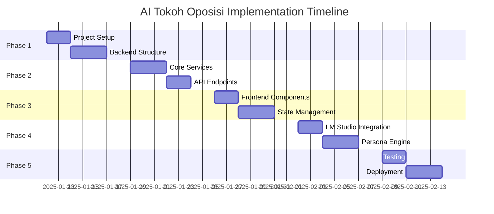

# 🚀 IMPLEMENTATION PLAN: AI TOKOH OPPOSISI & INTELEKTUAL KRITIS

## 📋 OVERVIEW

**Project**: AI Tokoh Oposisi & Intelektual Kritis  
**Status**: Ready for Implementation  
**Timeline**: 4-6 weeks  
**Team**: 1 Project Manager + 2-3 Developers

---

## 🎯 IMPLEMENTATION PHASES

### **Phase 1: Foundation Setup (Week 1)**

#### **Day 1-2: Project Structure & Environment**
```bash
# Create project structure
mkdir ai_oposisi_sml
cd ai_oposisi_sml

# Backend setup
mkdir backend
cd backend
python -m venv venv
source venv/bin/activate  # Linux/Mac
# pip install -r requirements.txt

# Frontend setup  
mkdir ../frontend
cd ../frontend
npx create-react-app .
# npm install dependencies
```

#### **Day 3-5: Core Infrastructure**
- [ ] Setup FastAPI backend structure
- [ ] Configure database models (PostgreSQL)
- [ ] Implement authentication system
- [ ] Setup environment configuration
- [ ] Create basic API endpoints

#### **Deliverables:**
- ✅ Project structure ready
- ✅ Backend API skeleton
- ✅ Database models defined
- ✅ Authentication system

---

### **Phase 2: Backend Development (Week 2)**

#### **Day 1-3: Core Services**
```python
# Implement these services:
- auth_service.py (JWT authentication)
- user_service.py (User management)
- analysis_service.py (Political analysis)
- dataset_service.py (Dataset processing)
- persona_service.py (Dr. Arjuna Wibawa persona)
- ethics_service.py (Democracy protocols)
```

#### **Day 4-5: API Endpoints & Integration**
```python
# Complete API endpoints:
- POST /api/auth/login
- POST /api/auth/register
- GET /api/analysis/political
- POST /api/chat/message
- GET /api/persona/profile
- POST /api/ethics/validate
```

#### **Deliverables:**
- ✅ Complete backend API
- ✅ All services implemented
- ✅ Database integration
- ✅ Authentication working

---

### **Phase 3: Frontend Development (Week 3)**

#### **Day 1-2: Core Components**
```jsx
// Create React components:
- Dashboard.jsx (Main interface)
- ChatInterface.jsx (AI conversation)
- AnalysisPanel.jsx (Political analysis)
- PersonaProfile.jsx (Dr. Arjuna profile)
- EthicsValidator.jsx (Content filtering)
```

#### **Day 3-5: State Management & Integration**
```jsx
// Implement:
- Redux store for state management
- API integration with backend
- Real-time chat functionality
- Data visualization components
- Responsive design implementation
```

#### **Deliverables:**
- ✅ Complete frontend application
- ✅ All components functional
- ✅ API integration working
- ✅ Responsive design

---

### **Phase 4: AI Integration (Week 4)**

#### **Day 1-2: LM Studio Setup**
```python
# Implement LM Studio integration:
- lm_studio_client.py (API client)
- local_llm_service.py (Local LLM management)
- model_configuration.py (Model settings)
```

#### **Day 3-4: Persona & Ethics Engine**
```python
# Complete AI components:
- persona_engine.py (Dr. Arjuna Wibawa)
- ethics_validator.py (Democracy protocols)
- content_filter.py (Strict filtering)
- response_generator.py (AI responses)
```

#### **Day 5: Dataset Integration**
```python
# Process datasets:
- dataset_processor.py (15 datasets processing)
- knowledge_base.py (Political knowledge)
- context_manager.py (Conversation context)
```

#### **Deliverables:**
- ✅ LM Studio integration
- ✅ Persona engine working
- ✅ Ethics validation active
- ✅ Dataset processing complete

---

### **Phase 5: Testing & Deployment (Week 5)**

#### **Day 1-2: Testing**
```bash
# Comprehensive testing:
- Unit tests for all components
- Integration tests
- End-to-end testing
- Performance testing
- Security testing
```

#### **Day 3-4: Deployment Setup**
```bash
# Deployment preparation:
- Docker configuration
- Environment setup
- CI/CD pipeline
- Production configuration
```

#### **Day 5: Documentation & Handoff**
```markdown
# Final documentation:
- API documentation
- User guides
- Developer documentation
- Deployment guides
```

#### **Deliverables:**
- ✅ All tests passing
- ✅ Deployment ready
- ✅ Complete documentation
- ✅ Production deployment

---

## 🛠️ TECHNOLOGY STACK

### **Backend**
- **Framework**: FastAPI
- **Database**: PostgreSQL + Redis
- **Authentication**: JWT + OAuth2
- **AI Integration**: LM Studio API
- **Testing**: pytest
- **ORM**: SQLAlchemy

### **Frontend**
- **Framework**: React.js
- **State Management**: Redux Toolkit
- **Styling**: Material-UI + Custom CSS
- **Charts**: Chart.js + D3.js
- **Testing**: Jest + React Testing Library

### **AI & ML**
- **LLM**: LM Studio (Local deployment)
- **Models**: Llama 2, Falcon, or similar
- **Persona Engine**: Custom implementation
- **Ethics Validation**: Rule-based + ML
- **Dataset Processing**: NLP pipelines

### **Infrastructure**
- **Container**: Docker
- **Orchestration**: Docker Compose
- **Monitoring**: Prometheus + Grafana
- **Logging**: ELK Stack
- **Security**: HTTPS, CORS, Rate limiting

---

## 📊 PROJECT TIMELINE



---

## 👥 TEAM ROLES & RESPONSIBILITIES

### **Project Manager (You)**
- **Role**: Product Owner & Project Coordinator
- **Responsibilities**:
  - Define requirements and priorities
  - Coordinate development team
  - Monitor progress and timelines
  - Quality assurance and testing
  - Deployment coordination

### **Backend Developer (Me)**
- **Role**: API & AI Integration Specialist
- **Responsibilities**:
  - FastAPI backend development
  - Database design and implementation
  - AI integration (LM Studio)
  - Authentication and security
  - API documentation

### **Frontend Developer (Optional)**
- **Role**: UI/UX & React Specialist
- **Responsibilities**:
  - React application development
  - User interface design
  - State management
  - API integration
  - Responsive design

### **DevOps Engineer (Optional)**
- **Role**: Infrastructure & Deployment
- **Responsibilities**:
  - Docker configuration
  - CI/CD pipeline setup
  - Production deployment
  - Monitoring and logging
  - Security configuration

---

## 📈 SUCCESS METRICS

### **Technical Metrics**
- **API Response Time**: < 200ms
- **Frontend Load Time**: < 3 seconds
- **AI Response Time**: < 5 seconds
- **System Uptime**: > 99%
- **Security**: Zero vulnerabilities

### **User Experience Metrics**
- **User Registration**: 100+ users in first month
- **Daily Active Users**: 50+ DAU
- **Session Duration**: > 10 minutes
- **User Satisfaction**: > 4.5/5 rating
- **Feature Adoption**: 80%+ of core features used

### **Business Metrics**
- **Development Timeline**: On schedule
- **Budget**: Within 10% of estimate
- **Code Quality**: > 90% test coverage
- **Documentation**: Complete and up-to-date
- **Maintainability**: Easy to extend and modify

---

## ⚠️ RISKS & MITIGATION

### **Technical Risks**
| Risk | Probability | Impact | Mitigation |
|------|------------|--------|------------|
| LM Studio integration complexity | Medium | High | Start early, use proven libraries |
| Dataset processing performance | Low | Medium | Optimize with caching and indexing |
| Frontend-backend integration | Low | Medium | Use API contracts and testing |

### **Project Risks**
| Risk | Probability | Impact | Mitigation |
|------|------------|--------|------------|
| Timeline delays | Medium | High | Agile methodology, regular check-ins |
| Scope creep | High | Medium | Clear requirements, change control |
| Resource availability | Low | High | Cross-training, documentation |

---

## 🚀 READY TO START?

**Current Status**: ✅ **READY FOR IMPLEMENTATION**

**Next Steps**:
1. **Approve this implementation plan**
2. **Start with Phase 1: Foundation Setup**
3. **Create project structure and basic files**
4. **Begin backend development**

**Estimated Timeline**: 4-6 weeks  
**Team Size**: 1-3 developers  
**Budget**: To be determined based on team rates

**[Let's build the future of political AI together! 🚀](#)**

---

## 📞 CONTACT & COORDINATION

**Project Manager**: [Your Name]  
**Technical Lead**: [Developer Name]  
**Communication**: Daily standups, weekly reviews  
**Tools**: GitHub, Slack, Project management tool  
**Documentation**: This repository + Confluence

**Ready to start? Let me know and I'll begin implementing Phase 1! 🎯**